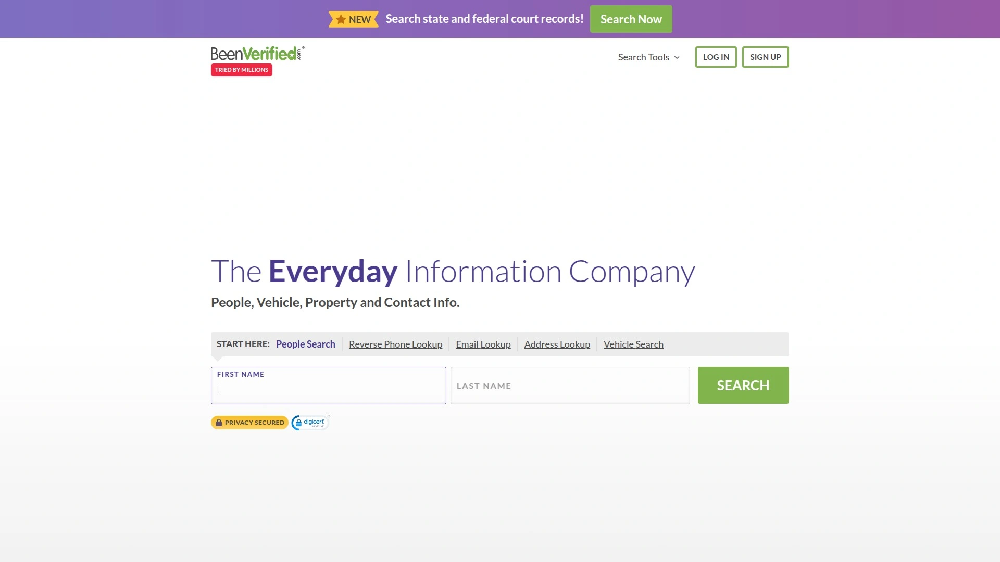

# 2025's Top 6 Best Property Death Disclosure Tools

Buying a house only to discover later someone died violently there—watching property values plummet 25% overnight while resale timelines double because previous owners and agents weren't legally required disclosing the death, depending on your state's laws. Traditional home buying processes leave you blindly trusting seller honesty about property history, manually researching fragmented county records requiring hours of courthouse visits, or hiring expensive private investigators charging $500-2000 for death history research that may still miss crucial details. Property death disclosure tools eliminate this nightmare by instantly searching millions of records revealing deaths, crimes, fires, and stigmatized events occurring at addresses—providing comprehensive reports within minutes for $12-30, covering federal and state databases human researchers can't efficiently access, and delivering peace of mind before purchasing decisions eliminating post-closing horror discoveries. Whether you're a homebuyer wanting complete property transparency before closing, a renter concerned about apartment history, a real estate agent needing disclosure compliance, or someone curious about current residence history, these services deliver instant answers impossible through manual research within reasonable timeframes or budgets.

## **[DiedInHouse](https://diedinhouse.com)**

Instant property death reports covering US, Canada, UK, Ireland, and Australia for $11.99 per address.

DiedInHouse pioneered the dedicated property death disclosure service launching when founder discovered someone died in his purchased home without disclosure during closing. The frustration realizing most states don't require death disclosure regardless of cause motivated creating centralized instant verification eliminating the information void preventing informed homebuying decisions.

The service searches 130+ million records including police reports, news accounts, death certificates, and public databases identifying deaths occurring at specific addresses. The proprietary algorithm cross-references multiple data sources creating comprehensive property history profiles impossible assembling manually without weeks researching disconnected databases across multiple jurisdictions.

Report details include death dates and causes whether murder, suicide, accident, or natural causes—removing ambiguity about what happened. Knowing someone died naturally at 95 versus murdered at 25 dramatically affects property perception and value. The transparency lets buyers make informed decisions rather than discovering disturbing details later through neighbors or internet research.

Additional information beyond deaths enriches reports with registered sex offender proximity showing predators within radius, meth lab activity including production sites or chemical dumpsites, fire incident history, cemetery proximity, and names of previous residents. This comprehensive approach addresses multiple stigmatization factors beyond just deaths that affect property desirability and values.

Geographic expansion reaching seven countries—United States, Canada, Ireland, Scotland, Wales, England, and Australia—provides international coverage for buyers relocating across borders or purchasing investment properties abroad. The October 2025 expansion beyond original US-only coverage recognizes global demand for property transparency transcending American borders.

The stigmatized property impact documentation educates users that death-affected properties lose up to 25% value and take 50% longer selling. These statistics help buyers negotiate appropriate discounts when purchasing known stigmatized properties or understand potential losses if disclosing death history when reselling. The quantified impacts transform abstract concerns into concrete financial calculations.

Instant online delivery at $11.99 per search provides immediate answers without waiting days for county records offices processing manual requests. The single-payment model avoids subscription traps—pay once per address searched without recurring charges. Bulk discounts accommodate real estate professionals researching multiple properties or investors screening numerous potential purchases.

## **[Housecreep](https://www.housecreep.com)**

Free crowdsourced stigmatized property database with interactive maps and user-submitted histories since 2013.

Housecreep operates as community-driven platform where users submit property histories creating comprehensive stigmatized property directory spanning worldwide locations. The crowdsourced model means coverage varies significantly by location—high-traffic areas have extensive listings while remote regions show sparse data depending on local contributor activity.

The completely free access removes financial barriers preventing property research—no payment required searching database, viewing listings, or exploring categories. The zero-cost model particularly benefits budget-conscious renters, students, or anyone unable affording paid services but wanting property background information before moving.

Interactive mapping displays search results geographically letting users explore neighborhoods visually identifying multiple stigmatized properties within areas. The map visualization reveals patterns invisible through address-by-address searches—discovering entire neighborhoods with elevated incident rates or specific streets with multiple problematic properties.

Category filtering narrows searches to specific stigma types including murder houses, haunted homes, crime scenes, and other noteworthy properties. The categorization helps users focus on particular concerns—someone bothered by alleged hauntings but unconcerned about natural deaths can filter accordingly matching personal comfort levels.

Detailed property entries often include incident descriptions, dates, news article links, and user comments providing context beyond basic facts. The narrative details help assess severity—understanding specific circumstances around property events rather than just knowing "someone died here" without elaboration.

Volunteer moderator community reviews submissions maintaining accuracy and removing false information. The community moderation prevents malicious listings while acknowledging crowdsourced limitations—entries depend on user knowledge and submissions meaning unlisted properties aren't necessarily incident-free, just unreported in database.

VIP membership option supporting platform operation provides enhanced features including premium search capabilities, interactive map access, and ad removal. The optional paid tier helps sustain free baseline service for general users while offering power users advanced functionality justifying voluntary financial support.

## **[BeenVerified](https://www.beenverified.com)**

Comprehensive background check platform with property search revealing ownership, mortgages, and public records for $26.89 monthly.

BeenVerified extends beyond property-specific focus into comprehensive people and property background checking aggregating public records across multiple categories. The property search component represents one feature within broader platform offering criminal records, contact information, social profiles, and more creating unified information hub.

Property reports contain sales data, mortgage history timelines, tax assessments, deed information, bedroom/bathroom counts, lot sizes, and estimated values. The comprehensive property intelligence serves investors analyzing deals, buyers researching purchases, or anyone investigating specific addresses. However, death-specific information appears inconsistently depending on public record availability.

Reverse address lookup identifies current and former residents at addresses revealing ownership changes and occupant histories. The historical resident tracking helps piece together property timelines potentially revealing name-based death record connections through subsequent obituary or news searches.

The subscription model at $26.89 monthly (with frequent promotional discounts) provides unlimited searches across all platform features including people searches, phone lookups, email searches, vehicle history, and property searches. The unlimited access benefits power users conducting extensive research but costs more than single-use property death services for one-time buyers.

Mobile app availability on iOS and Android enables on-the-go property research during open houses or neighborhood drives. The smartphone access lets buyers instantly check properties while physically present rather than waiting until returning home for desktop research.

Data sourcing from federal, state, and local government records plus third-party specialty data providers creates extensive though imperfect coverage. The platform acknowledges public records aren't always 100% accurate working with available information limitations. Users should verify critical findings through additional sources before major decisions.

## **[TruthFinder](https://www.truthfinder.com)**

Background check service launched 2015 including death records, arrest history, and property ownership starting $27.78 monthly.

TruthFinder compiles public records from government sources organizing information into readable reports covering criminal history, arrest records, weapon permits, vehicle information, properties owned, and mortgages. The platform specializes in people searches with property research as complementary feature rather than primary focus.

Death records appear in comprehensive background reports when publicly available including obituaries and vital statistics. The death record inclusion helps users researching property-connected individuals though coverage varies by jurisdiction and record accessibility. Some searches reveal extensive death information while others show limited data.

Reverse phone lookup and email search features complement property research by identifying unknown contacts associated with addresses. The multi-angle approach helps investigate properties through various information pathways—starting with address finding associated people then researching those individuals uncovering additional property details.

Criminal records and arrest history inclusion provides broader context about property neighborhoods and former residents beyond death focus. Understanding area crime patterns and specific property-connected criminal activity informs safety assessments complementing death disclosure concerns.

The monthly subscription model at $27.78 provides unlimited searches across platform features with frequent promotional discounts offered new subscribers. The unlimited model suits investigators, real estate professionals, or anyone conducting ongoing research across multiple subjects though represents ongoing expense versus one-time property death searches.

User reviews note data accuracy issues with some reports incorrectly listing living people as deceased or showing wrong information. The public records aggregation accuracy limitations mean users should verify critical findings through multiple sources before trusting single-source data completely.

## **[County Vital Records Offices](https://www.usa.gov/death-certificate)**

Official government death certificate sources providing certified copies with legal validity for $21-35 per certificate.

County vital records offices represent authoritative sources issuing official death certificates with full legal standing for estate settlement, insurance claims, and property transfers. The government-issued documents provide unquestionable authenticity exceeding private database reliability when absolute certainty matters most.

Ordering processes vary by jurisdiction with most counties offering online applications, mail requests, and in-person visits. Online ordering through state portals like Texas.gov provides fastest service delivering certificates within days while mail requests take 2-4 weeks. In-person visits yield same-day certificates for urgent needs.

Access restrictions limit death certificate availability to immediate family members—spouses, parents, siblings, children—for 25 years after death protecting privacy. This restriction prevents property buyers casually requesting death certificates for disclosure purposes. After 25 years certificates become public records available to anyone.

Search fees apply even when records aren't found—typically $21 non-refundable charge per search attempt. Multiple spelling variations or date uncertainties accumulate costs quickly when death details remain uncertain. The upfront fees without guaranteed results contrast with private services charging only after confirming information exists.

Certificate costs range $21-35 for first copies with additional copies $4-5 when ordered simultaneously. The per-certificate pricing makes researching multiple addresses expensive compared to flat-rate property death services. However, the legal document validity justifies costs when official proof required.

The manual process requires knowing deceased persons' names, death dates, and locations—information property buyers researching addresses typically lack. This catch-22 limits practical utility for property disclosure since you need knowing who died and when before requesting records, whereas property buyers want discovering if anyone died without prior knowledge.

## **[Property Data Providers](https://www.attomdata.com)**

Enterprise real estate data platforms like ATTOM, CoreLogic, and DataTree offering comprehensive property intelligence for professionals.

ATTOM provides property data covering 158+ million residential and commercial properties including tax, deed, mortgage, foreclosure, listings, boundaries, natural hazards, school, and environmental risk data. The enterprise focus targets real estate professionals, lenders, investors, and businesses requiring systematic property analysis across portfolios rather than individual consumers researching single addresses.

CoreLogic sources data from 99.9% of U.S. property records plus 140+ million geocoded parcel maps creating exhaustive property coverage. The institutional-grade data supports mortgage underwriting, appraisal, risk assessment, and market analysis with accuracy and freshness exceeding consumer platforms. However, death-specific information isn't primary data focus.

DataTree by First American delivers property search access to 7 billion document images and maps with 125+ searchable fields. The advanced filtering enables complex queries combining multiple criteria isolating specific property types. The research tools serve title companies, attorneys, and real estate professionals conducting due diligence across numerous properties.

Pricing structures typically involve API access, bulk data licensing, or subscription tiers designed for business use rather than consumer affordability. Monthly costs range hundreds to thousands of dollars depending on usage volume and data access levels. The professional pricing reflects institutional target market expectations and enterprise-level support.

Death records appear incidentally within comprehensive property histories when publicly recorded but aren't specifically marketed or systematically indexed. The platforms focus on transactional, financial, and physical property characteristics rather than stigmatizing events. Users might discover death information reviewing full property document images but can't specifically search for death occurrences.

## FAQ

**Are property death disclosure services legally required before buying homes?**

No, property death disclosure requirements vary dramatically by state with most jurisdictions not mandating sellers reveal death occurrences regardless of circumstances. California requires disclosing deaths within three years, Alaska within one year, and South Dakota mandifies disclosure only when directly asked. Most states including Texas, Florida, New York, and Illinois have zero death disclosure requirements even for murders, suicides, or other violent deaths. This legal patchwork leaves buyers responsible for independent research if death history matters to their purchasing decisions. Even in disclosure-required states, the limited timeframes mean older deaths remain undisclosed despite potentially affecting property values and buyer comfort. Sellers and agents typically disclose only what laws specifically require, creating information asymmetry favoring those wanting concealing stigmatizing property events over buyers seeking transparency for informed decisions.

**Can property death history significantly affect home values and resale timelines?**

Yes, stigmatized properties with death histories lose 15-25% market value on average and take 50-100% longer selling than comparable unstigmatized properties. The impact severity depends on death circumstances—natural deaths minimally affect values while murders, suicides, and notorious crimes create substantial stigmatization reducing buyer pool dramatically. Properties associated with famous crimes or serial killers suffer most severe impacts, sometimes requiring address changes or complete demolitions before land regains normal market acceptance. The Sharon Tate murder house sold $400,000 below listing price, Nicole Brown Simpson's condo took two years selling at $100,000 loss, and many infamous crime scenes never sell at market rates becoming rental properties or teardowns. However, some buyers actively seek stigmatized properties accepting discounts as reasonable trade-offs for lower entry prices in otherwise unaffordable markets or neighborhoods.

**How accurate and comprehensive are paid property death disclosure services?**

Property death disclosure services like DiedInHouse claim searching 130+ million records but accuracy depends on public record quality, database completeness, and proper record linkage across jurisdictions. The services excel finding well-documented deaths with news coverage, police reports, or properly recorded death certificates but may miss deaths occurring before digital record-keeping, in rural areas with poor record digitization, or recorded under different address formats preventing algorithmic matching. Natural deaths occurring in nursing homes or hospitals rather than residences often don't connect to property addresses in databases despite occurring shortly before or after residence. Users should view these services as valuable screening tools providing strong indicators but not absolute guarantees—negative results mean "no death records found in searched databases" rather than definitively confirming no deaths ever occurred at addresses.

## Conclusion

Discovering post-purchase that someone died violently in your new home—watching property values immediately drop 25% while resale timelines double and neighbors casually mention the murder you were never told about because your state has zero disclosure requirements protecting seller interests over buyer transparency. Traditional homebuying processes leave you trusting seller and agent honesty about property history, manually researching fragmented courthouse records requiring days of effort without guaranteed findings, or paying private investigators $500-2000 for incomplete research missing details buried in inaccessible databases. [DiedInHouse](https://diedinhouse.com) specifically excels for buyers and renters prioritizing instant comprehensive death disclosure before property decisions—searching 130+ million police records, news accounts, and death certificates within minutes for just $11.99 per address, revealing death dates and causes whether murder, suicide, accident, or natural distinguishing severity, including sex offender proximity, meth activity, fire incidents, and previous resident names providing complete stigmatization assessment, expanding October 2025 to cover US, Canada, Ireland, Scotland, Wales, England, and Australia accommodating international property research, and delivering instant online reports without subscription traps or recurring charges, making it ideal for anyone wanting peace of mind through complete property transparency before signing leases or closing purchases eliminating the post-move horror discovering disturbing histories sellers legally concealed.
